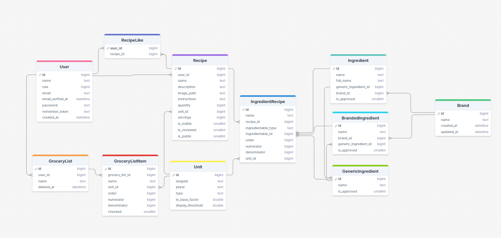

# Kitchen Assistant
## Summary
The Kitchen Assistant is a recipe website that makes sharing and viewing recipes easy. 
Ingredients are linked to recipes and can be used to build ingredient lists. These lists can be used to create a Kroger shopping cart.
## Link to Website
Right now the website is private and requires an invite link to register, but the website can be found at https://kitchen.jediwebb.com 
## Demo
The Demo video does not play on Github. You can follow the link, download it and view it that way

## Diagrams

## Images

## Learning
One of the biggest things I learned was the difficulty and power of working with a team. Because there are four of us, and one of us has professional experience, the codebase was always changing
This meant I often had to understand the changes and update and debug my configurations as the PHP versions, libraries, and workflows changed. This added some overhead to making changes. Github relieved some of these collaboration
challenges, but not all. Despite this, the codebase made massive improvements, becoming better structured, gaining more features, and becoming better tested. I was able to learn more from my teammates and we were able to share ideas.
More progress was made together than it would have been alone.  

I have also become better in Typescript and React. I learned that creating types for the props of components can make it much easier to reuse components in the future
### Key Learning
- Teamwork on a large project
- React with Typescript, specifically creating reusable components
- How to setup local PHP development, configurations, and extensions

## AI
We have tried to avoid AI as much as possible to ensure our website stays cheap and predictable. 
We did, however, usd AI to generate embeddings for recipes for better searching. Although we tested with Gemini, these embeddings were created through a request to OpenAIs APIs.
Our recipe search first checks direct text match, and then search by embedding similarity.
Some of my teammates used AI to help build new features. I mostly used AI to create new test cases and help me debug code. I used ChatGPT and Gemini mostly.

## Why this Project
This website started as the passion project of one of my coworkers. I have interest in this project as I feel it will help me cook healthier and better plan my meals. 
This is something I have struggled with as a busy college student. I have often neglected meal prep, which has impacted my diet. I believe having a powerful, free, and simple tool to find new recipes and plan them could help me eat cheaper and healthier.
It is also fun to build something new with friends.

## Technologies
- PHP Laravel Framework with a mySQL backend
- Authentication uses a combination of a users mySQL table and built in utilities for Laravel
- React with Typescript for the frontend
- PHPUnit to create and run test cases
- CI Pipeline to automatically test, lint, and push changes to production
